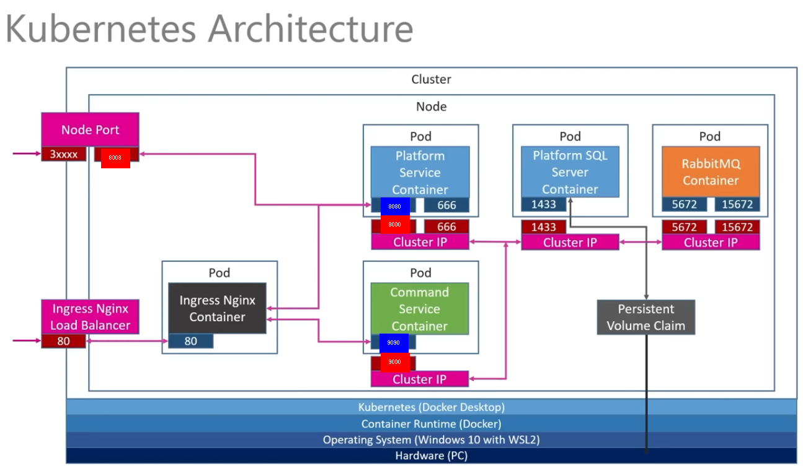

This API uses a microservice architecture implemented with Kubernates, RabbitMQ, Docker, Nginx and GRPC

# Command Platform API

This API uses a microservice architecture implemented with Kubernates, RabbitMQ, Docker, Nginx and GRPC

This project will provide an API to manage all platforms a company has acquired as well as its related and most used commands, for instance: 
- Platform: AWS EC2
  Commands:
  * aws ec2 create-key-pair --key-name my-key-pair
  * aws iam list-users --output table
  * aws ec2 start-instances --instance-ids <value>
  * etc

- Platform: Azure
  Commands:
  * az vm start --resource-group myResourceGroup --name myVM
  * az vm delete --resource-group myResourceGroup --name myVM
  * az vm list
  * etc

*This API has the following microservice architecture implemented with Kubernates, RabbitMQ, Docker, Nginx*

# Platform Service API methods
- List of all platforms
- Create a new platform
  - After Creation of a new Platform, CommandService should be notified
- Get a platform by Id

# Commands Service API methods
- List of all Commands
- Create a new Command
- Get a Command by Id
  
# Deployment

1. Go to K8S folder and run the following command to instantiate all kubernates resources

`kubectl apply -f ./`

2. Configure your hosts file to be able to resolve the following URL
  `127.0.0.1 commandplatform.com`
1. Platform Service EndPoint
    http://commandplatform.com/api/platforms
2. Commands Service EndPoint
    http://commandplatform.com/api/c/platforms

