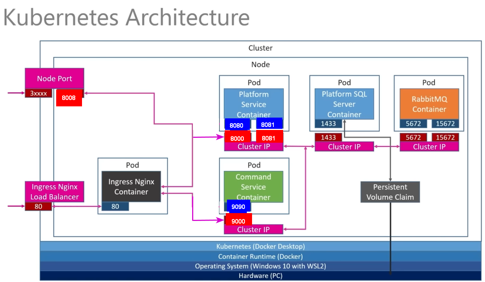

# Command Platform API

This project will provide an API to manage all plaftforms a company has acquired as well as its related and most used commands, for instance: 
- Platform: AWS EC2  
  Commands:

- Platform: Azure DevOps
  Commands:

*This API has the following microservice architecture implemented with Kubernates, RabbitMQ, Docker, Nginx*

# Platform Service API methods
- List of all platforms
- Create a new platform
  - After Creation of a new Platform, CommandService should be notified
- Get a platform by Id

# Commands Service API methods
- List of all Commands
- Create a new Command
- Get a Command by Id
  
# Deployment

1. Go to K8S folder and run the following command to instantiate all kubernates resources

`kubectl apply -f ./`

2. Platform Service EndPoint
3. Commands Service EndPoint

